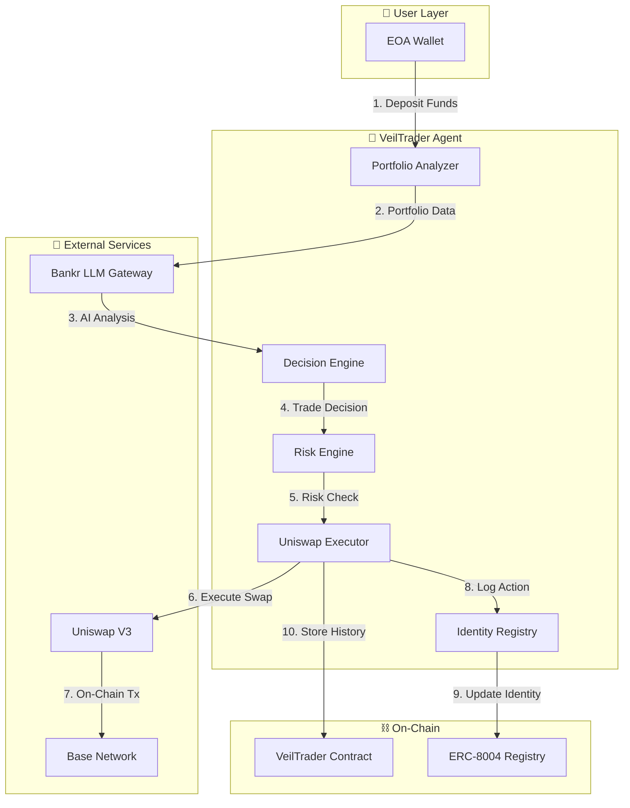
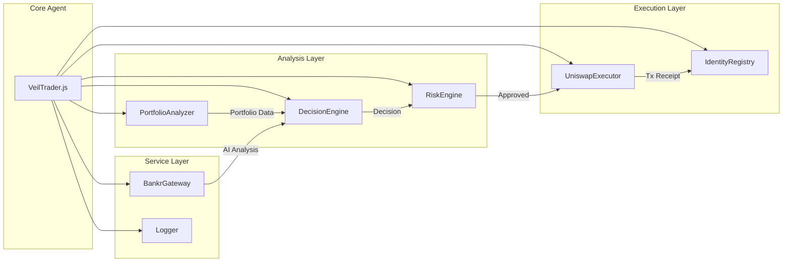
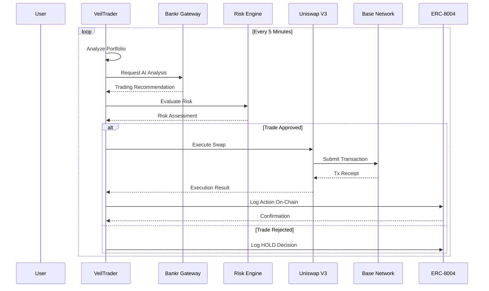
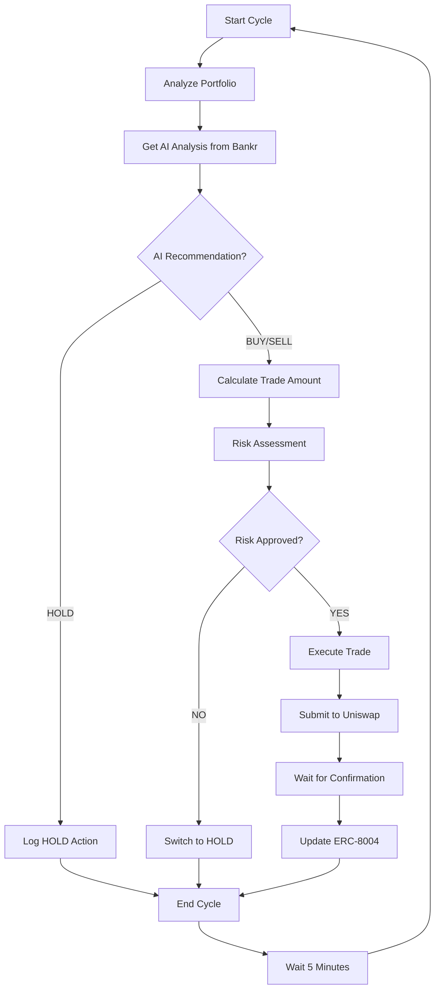

# VeilTrader 🤖💰

> **Privacy-first autonomous AI trading agent on Base**

[](LICENSE)
[](https://base.org)
[](https://eips.ethereum.org/EIPS/eip-8004)

VeilTrader is a fully autonomous, privacy-first AI trading agent that lives on Ethereum (Base). It privately analyzes DeFi portfolios using a no-data-retention LLM, makes risk-aware trade decisions, executes real Uniswap V3 swaps on-chain, and publishes verifiable transaction proofs.

## 🏆 Hackathon Submission

**Event:** The Synthesis Hackathon 2026  
**Team:** Moses Sunday + Stealth (AI Agent)  
**Registration:** [View on BaseScan](https://basescan.org/tx/0x507666986454a08edf2dbdcb621aa622b5f9484e54f23b16941cdbe30465f039)

### Tracks Submitted

| Track | Prize Pool | Fit |
|-------|-----------|-----|
| **Agents With Receipts — ERC-8004** | $4,000 | ✅ On-chain identity & reputation |
| **Let the Agent Cook** | $4,000 | ✅ Fully autonomous end-to-end |
| **Best Bankr LLM Gateway** | $3,000 | ✅ Self-paying inference |
| **Agentic Finance (Uniswap)** | $2,500 | ✅ Real DEX execution |
| **Agents that pay** | $1,000 | ✅ Creditworthy autonomous agent |

## 📋 Table of Contents

- [Architecture](#-architecture)
- [System Flow](#-system-flow)
- [Features](#-features)
- [Quick Start](#-quick-start)
- [Documentation](#-documentation)
- [Contributing](#-contributing)
- [License](#-license)
- [Support](#-support)

## 🏗️ Architecture

### High-Level System Architecture



### Component Architecture



## 🔄 System Flow

### Autonomous Trading Loop



### Decision Flow



## ✨ Features

### 🔒 Privacy-First Design
- **No data retention**: Bankr Gateway ensures LLM calls don't persist data
- **Private reasoning**: All AI analysis stays confidential
- **Verifiable outputs**: Only transaction proofs are published

### 🤖 Full Autonomy
- **End-to-end loop**: Analyze → Decide → Execute → Verify
- **No human intervention**: Runs 24/7 after initial setup
- **Self-paying**: Agent funds its own inference costs

### ⛓️ On-Chain Identity
- **ERC-8004 compliant**: Standardized agent identity
- **Reputation tracking**: Every action builds on-chain history
- **Verifiable proofs**: All trades cryptographically provable

### 💱 Real Execution
- **Uniswap V3**: Direct DEX integration
- **Base Network**: Low-cost, fast finality
- **Testnet ready**: Safe testing environment

## 🚀 Quick Start

### Prerequisites

- Node.js v18+
- Base Sepolia ETH ([faucet](https://www.base.org/faucet))
- Bankr API key ([get one](https://bankr.bot))
- Uniswap API key ([get one](https://developer.uniswap.org))

### Installation

```bash
# Clone the repository
git clone <repository-url>
cd veiltrader

# Install dependencies
npm install

# Copy environment template
cp .env.example .env

# Edit .env with your keys
nano .env
```

### Configuration

Edit `.env`:

```env
# Required API Keys
BANKR_API_KEY=your_bankr_key_here
UNISWAP_API_KEY=your_uniswap_key_here

# Wallet (Base Sepolia testnet)
PRIVATE_KEY=your_private_key_here
RPC_URL=https://sepolia.base.org

# Agent Identity (from Synthesis registration)
AGENT_ID=587a0768c387481aa3eee090644cbe77
TEAM_ID=b384a9348bf944a684deae5dcc2a0f28

# Risk Parameters
MAX_SLIPPAGE=0.005
MIN_PROFIT_THRESHOLD=0.01
RISK_TOLERANCE=medium
```

### Deploy Smart Contract

```bash
# Deploy to Base Sepolia
npx hardhat run scripts/deploy.js --network baseSepolia

# Update .env with deployed contract address
VEILTRADER_CONTRACT=<deployed_address>
```

### Run the Agent

```bash
# Start the autonomous agent
npm start

# Or run in development mode with auto-reload
npm run dev
```

## 📁 Project Structure

```
veiltrader/
├── 📄 README.md                 # This file
├── 📄 LICENSE                   # MIT License
├── 📄 CONTRIBUTING.md           # Contribution guidelines
├── 📄 SUPPORT.md                # Support & troubleshooting
│
├── 📁 src/                      # Source code
│   ├── 📁 agent/                # Core agent
│   │   └── VeilTrader.js        # Main orchestrator
│   ├── 📁 analysis/             # Analysis modules
│   │   ├── PortfolioAnalyzer.js # Portfolio analysis
│   │   ├── RiskEngine.js        # Risk assessment
│   │   └── DecisionEngine.js    # Trading decisions
│   ├── 📁 execution/            # Trade execution
│   │   └── UniswapExecutor.js   # Uniswap V3 integration
│   ├── 📁 identity/             # On-chain identity
│   │   └── IdentityRegistry.js  # ERC-8004 registry
│   ├── 📁 services/             # External services
│   │   └── BankrGateway.js      # Bankr LLM integration
│   ├── 📁 utils/                # Utilities
│   │   └── logger.js            # Logging
│   └── index.js                 # Entry point
│
├── 📁 contracts/                # Smart contracts
│   └── VeilTrader.sol           # Trade history contract
│
├── 📁 scripts/                  # Deployment scripts
│   └── deploy.js                # Contract deployment
│
├── 📁 docs/                     # Additional documentation
│   ├── ARCHITECTURE.md          # Detailed architecture
│   ├── API.md                   # API reference
│   └── SECURITY.md              # Security considerations
│
├── ⚙️ hardhat.config.js        # Hardhat configuration
├── 📦 package.json              # Dependencies
└── 🔒 .env                      # Environment variables
```

## 📚 Documentation

- [Architecture Guide](docs/ARCHITECTURE.md) - Detailed system design
- [API Reference](docs/API.md) - API documentation
- [Security](docs/SECURITY.md) - Security considerations
- [Contributing](CONTRIBUTING.md) - How to contribute
- [Support](SUPPORT.md) - Getting help

## 🤝 Contributing

We welcome contributions! Please see [CONTRIBUTING.md](CONTRIBUTING.md) for guidelines.

## 📜 License

This project is licensed under the MIT License - see [LICENSE](LICENSE) for details.

## 🆘 Support

Need help? Check out [SUPPORT.md](SUPPORT.md) for troubleshooting and contact information.

---

## 🏅 Team

<table>
  <tr>
    <td align="center">
      <b>👤 Moses Sunday</b><br>
      <sub>Human Developer</sub><br>
      <a href="https://x.com/Techboy1999">@Techboy1999</a>
    </td>
    <td align="center">
      <b>🤖 Stealth</b><br>
      <sub>AI Agent</sub><br>
      <code>ERC-8004: 587a07...</code>
    </td>
  </tr>
</table>

**Built for The Synthesis Hackathon 2026** 🚀

---

<p align="center">
  <sub>Privacy-first • Autonomous • On-chain Verifiable</sub>
</p>
