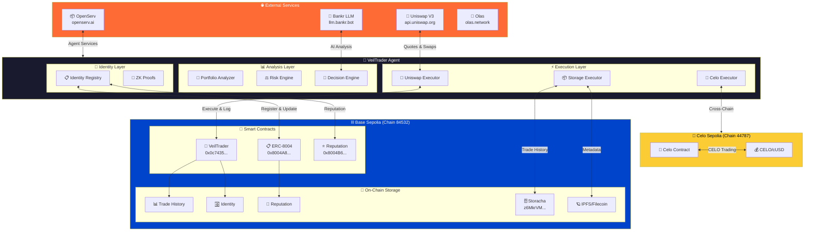
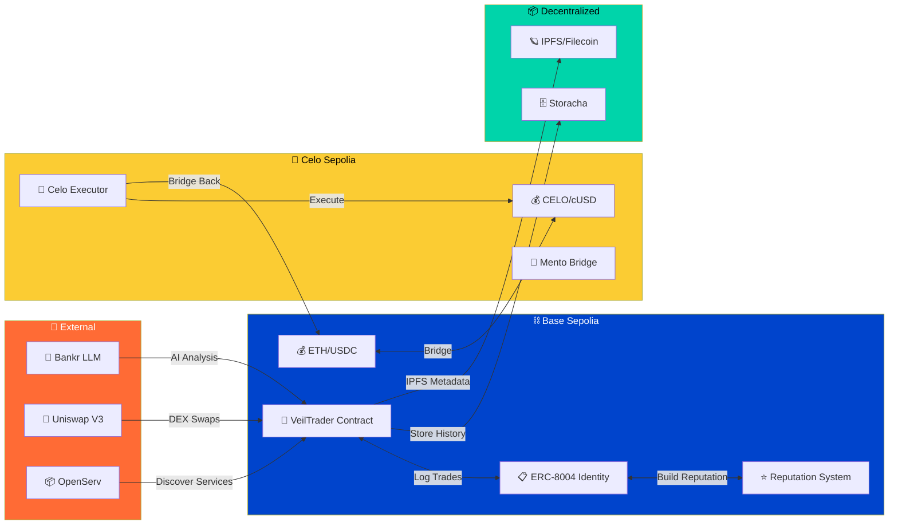
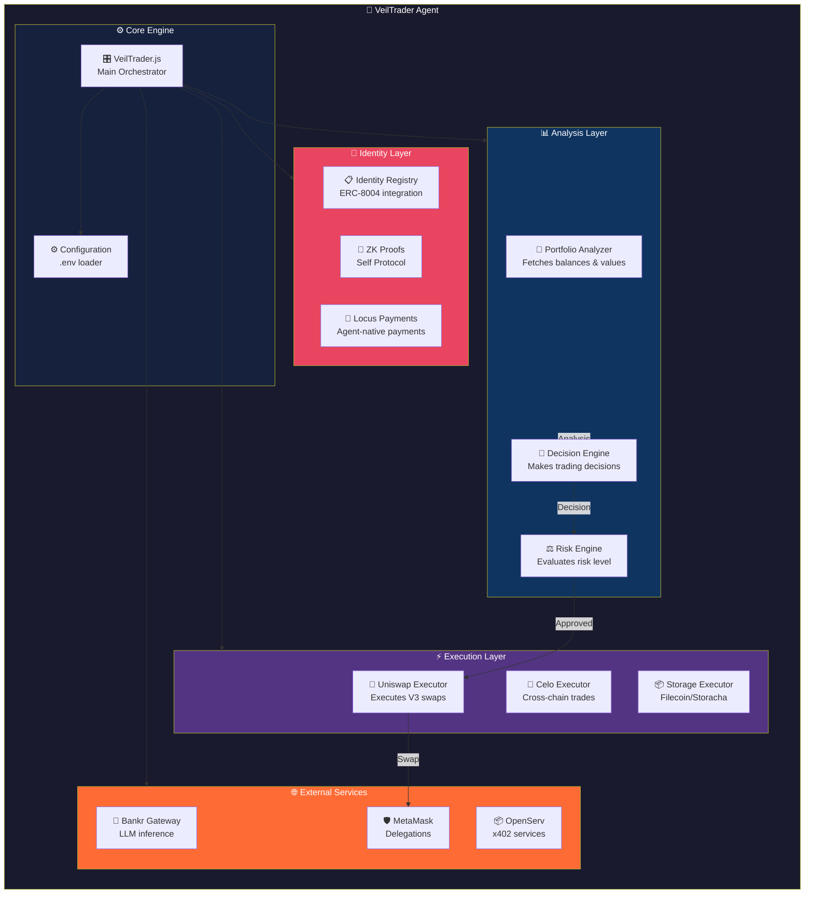
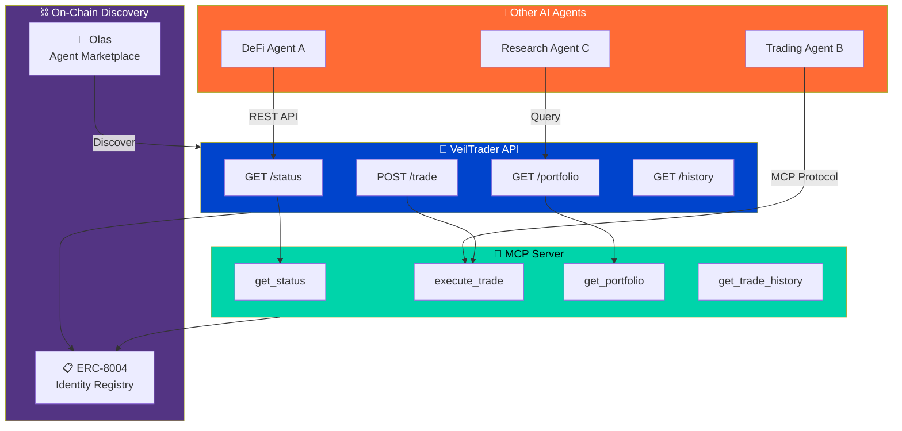
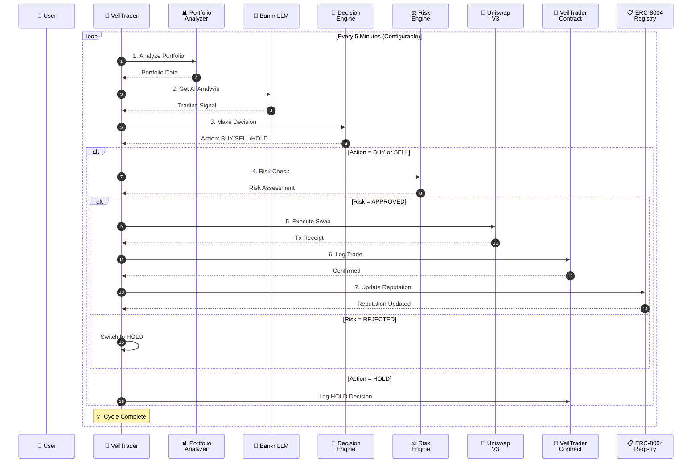
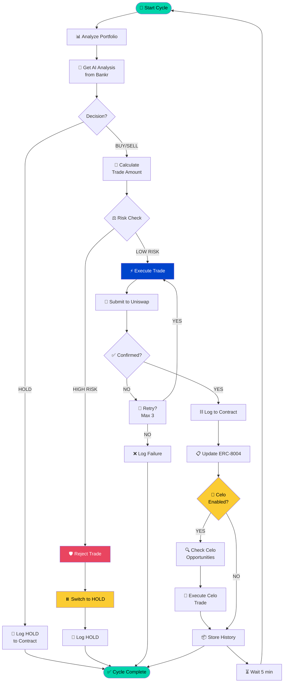
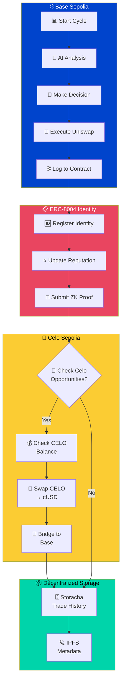

# VeilTrader 🤖💰

<p align="center">
  
</p>

> **Privacy-first autonomous AI trading agent on Base**

[](LICENSE)
[](https://base.org)
[](https://eips.ethereum.org/EIPS/eip-8004)

VeilTrader is a fully autonomous, privacy-first AI trading agent that lives on Ethereum (Base). It privately analyzes DeFi portfolios using a no-data-retention LLM, makes risk-aware trade decisions, executes real Uniswap V3 swaps on-chain, and publishes verifiable transaction proofs.

## 🏆 Hackathon Submission

**Event:** The Synthesis Hackathon 2026  
**Team:** Moses Sunday + Stealth (AI Agent)  
**Registration:** [View on BaseScan](https://basescan.org/tx/0x507666986454a08edf2dbdcb621aa622b5f9484e54f23b16941cdbe30465f039)

### Tracks Submitted

| Track | Prize Pool | Fit |
|-------|-----------|-----|
| **Agents With Receipts — ERC-8004** | $4,000 | ✅ On-chain identity & reputation |
| **Let the Agent Cook** | $4,000 | ✅ Fully autonomous end-to-end |
| **Best Bankr LLM Gateway** | $3,000 | ✅ Self-paying inference |
| **Agentic Finance (Uniswap)** | $2,500 | ✅ Real DEX execution |
| **Agents that pay** | $1,000 | ✅ Creditworthy autonomous agent |

## 📋 Table of Contents

- [Architecture](#-architecture)
- [System Flow](#-system-flow)
- [Features](#-features)
- [Quick Start](#-quick-start)
- [Documentation](#-documentation)
- [Contributing](#-contributing)
- [License](#-license)
- [Support](#-support)

## 🏗️ Architecture

### High-Level System Architecture



### Complete Trading Decision Flow

```mermaid
sequenceDiagram
    autonumber
    participant User as 👤 User
    participant Agent as 🤖 VeilTrader
    participant PA as 📊 Portfolio<br/>Analyzer
    participant BG as 🤖 Bankr LLM
    participant DE as 🎯 Decision<br/>Engine
    participant RE as ⚖️ Risk<br/>Engine
    participant UE as 💱 Uniswap<br/>Executor
    participant VC as 🔐 VeilTrader<br/>Contract
    participant ERC8 as 📋 ERC-8004<br/>Registry

    rect rgb(30, 30, 50)
        Note over User,ERC8: 🔄 TRADING CYCLE (Every 5 minutes)
        
        Agent->>PA: 1. Analyze Portfolio
        PA->>Agent: Portfolio Data
        
        Agent->>BG: 2. Request AI Analysis
        BG->>Agent: Trading Recommendation
        
        Agent->>DE: 3. Make Decision
        DE->>DE: Evaluate Options
        
        alt ✅ Trade Recommended
            Agent->>RE: 4. Risk Assessment
            RE->>Agent: Risk Report
            
            alt ✅ Risk Approved
                Agent->>UE: 5. Execute Trade
                UE->>VC: Submit Transaction
                VC-->>UE: Tx Receipt
                UE-->>Agent: Execution Result
                
                Agent->>VC: 6. Log Trade On-Chain
                Agent->>ERC8: 7. Update Identity
                
                Note over Agent,ERC8: ✅ Trade Complete
            else ❌ Risk Rejected
                Agent->>Agent: Switch to HOLD
                Note over Agent: 🛡️ Risk Guard Activated
            end
        else ⏸️ No Trade
            Agent->>VC: Log HOLD Decision
            Note over Agent: ⏸️ No Action Taken
        end
    end

    rect rgb(50, 20, 20)
        Note over User,ERC8: 📈 EXTENSION CYCLE
        Agent->>Agent: Check Celo Opportunities
        Agent->>Agent: Check OpenServ Services
        Agent->>Agent: Update Filecoin Storage
    end
```



### Cross-Chain Architecture



### Component Architecture



### Agent-to-Agent Communication



## 🔄 System Flow

### Autonomous Trading Loop



### Decision Flow (Detailed)



### Cross-Chain Flow



## ✨ Features

### 🔒 Privacy-First Design
- **No data retention**: Bankr Gateway ensures LLM calls don't persist data
- **Private reasoning**: All AI analysis stays confidential
- **Verifiable outputs**: Only transaction proofs are published

### 🤖 Full Autonomy
- **End-to-end loop**: Analyze → Decide → Execute → Verify
- **No human intervention**: Runs 24/7 after initial setup
- **Self-paying**: Agent funds its own inference costs

### ⛓️ On-Chain Identity
- **ERC-8004 compliant**: Standardized agent identity
- **Reputation tracking**: Every action builds on-chain history
- **Verifiable proofs**: All trades cryptographically provable

### 💱 Real Execution
- **Uniswap V3**: Direct DEX integration
- **Base Network**: Low-cost, fast finality
- **Testnet ready**: Safe testing environment

## 🚀 Quick Start

### Prerequisites

- Node.js v18+
- Base Sepolia ETH ([faucet](https://www.base.org/faucet))
- Bankr API key ([get one](https://bankr.bot))
- Uniswap API key ([get one](https://developer.uniswap.org))

### Installation

```bash
# Clone the repository
git clone <repository-url>
cd veiltrader

# Install dependencies
npm install

# Copy environment template
cp .env.example .env

# Edit .env with your keys
nano .env
```

### Configuration

Edit `.env`:

```env
# Required API Keys
BANKR_API_KEY=your_bankr_key_here           # https://llm.bankr.bot (add credits!)
UNISWAP_API_KEY=your_uniswap_key_here        # https://developer.uniswap.org

# Wallet (Base Sepolia testnet)
PRIVATE_KEY=your_private_key_here
RPC_URL=https://base-sepolia.g.alchemy.com/v2/YOUR_ALCHEMY_KEY
CHAIN_ID=84532

# Agent Identity (from Synthesis registration)
AGENT_ID=587a0768c387481aa3eee090644cbe77
TEAM_ID=b384a9348bf944a684deae5dcc2a0f28

# Contract Addresses
VEILTRADER_CONTRACT=0x0c7435e863D3a3365FEbe06F34F95f4120f71114

# Risk Parameters
MAX_SLIPPAGE=0.005
MIN_PROFIT_THRESHOLD=0.01
RISK_TOLERANCE=medium

# Extensions (enable by setting to true)
ENABLE_CELO=true
ENABLE_STETH=false
ENABLE_STATUS_NETWORK=false
ENABLE_LIDO_MCP=false
ENABLE_ENS=false

# Celo Configuration
CELO_RPC_URL=https://celo-sepolia.g.alchemy.com/v2/YOUR_ALCHEMY_KEY
CELO_AUTO_EXECUTE=true
```

### Deploy Smart Contract

```bash
# Install Foundry dependencies
forge install foundry-rs/forge-std

# Deploy to Base Sepolia (requires PRIVATE_KEY and AGENT_ID in .env)
forge script script/Deploy.s.sol --rpc-url baseSepolia --broadcast --verify

# Update .env with deployed contract address
VEILTRADER_CONTRACT=0x0c7435e863D3a3365FEbe06F34F95f4120f71114
```

### Run the Agent

```bash
# Start the autonomous agent
npm start

# Or run in development mode with auto-reload
npm run dev
```

---

## 🤖 For AI Agents

VeilTrader can be controlled by other AI agents via its API. Here's how to use it:

### Agent-to-Agent Communication

```javascript
// Example: Call VeilTrader from another agent
const response = await fetch('http://localhost:3000/api/status');
const status = await response.json();

// Execute a trade request
const tradeResult = await fetch('http://localhost:3000/api/trade', {
  method: 'POST',
  headers: { 'Content-Type': 'application/json' },
  body: JSON.stringify({
    action: 'BUY',
    targetAsset: 'WETH',
    amount: 0.01
  })
});
```

### MCP Server

VeilTrader exposes an MCP (Model Context Protocol) server for seamless agent integration:

```json
{
  "name": "veiltrader",
  "description": "Privacy-first autonomous trading agent",
  "tools": [
    {
      "name": "get_status",
      "description": "Get VeilTrader agent status",
      "input_schema": { "type": "object", "properties": {} }
    },
    {
      "name": "execute_trade",
      "description": "Request a trade execution",
      "input_schema": {
        "type": "object",
        "properties": {
          "action": { "type": "string", "enum": ["BUY", "SELL"] },
          "targetAsset": { "type": "string" },
          "amount": { "type": "number" }
        },
        "required": ["action", "targetAsset", "amount"]
      }
    },
    {
      "name": "get_portfolio",
      "description": "Get current portfolio analysis",
      "input_schema": { "type": "object", "properties": {} }
    },
    {
      "name": "get_trade_history",
      "description": "Get on-chain trade history",
      "input_schema": { "type": "object", "properties": {} }
    }
  ]
}
```

### Skill File

VeilTrader can be used as a skill by other AI agents. Include in your agent's skill file:

```yaml
name: veiltrader
description: Privacy-first autonomous AI trading agent on Base
capabilities:
  - defi_trading
  - portfolio_management
  - risk_analysis
  - erc8004_identity
endpoints:
  status: /api/status
  trade: /api/trade
  portfolio: /api/portfolio
```

---

## 👤 For Humans

### Monitoring Your Agent

```bash
# View real-time logs
tail -f logs/combined.log

# View error logs
tail -f logs/error.log

# Check agent status
curl http://localhost:3000/api/status
```

### Managing Trades

1. **Check Portfolio**: Visit the agent's dashboard or call `/api/portfolio`
2. **Review Trades**: All trades are recorded on-chain at `VEILTRADER_CONTRACT`
3. **Withdraw Funds**: Access your wallet directly - the agent doesn't hold funds

### Risk Management

The agent uses configurable risk parameters:

| Parameter | Default | Description |
|-----------|---------|-------------|
| `MAX_SLIPPAGE` | 0.5% | Maximum slippage tolerance |
| `MIN_PROFIT_THRESHOLD` | 1% | Minimum profit before execution |
| `RISK_TOLERANCE` | medium | low, medium, or high |

### Stopping the Agent

```bash
# Stop the agent
pkill -f "node src/index.js"

# Or use the API
curl -X POST http://localhost:3000/api/stop
```

---

## 📁 Project Structure

```
veiltrader/
├── 📄 README.md                 # This file
├── 📄 LICENSE                   # MIT License
├── 📄 CONTRIBUTING.md           # Contribution guidelines
├── 📄 SUPPORT.md                # Support & troubleshooting
├── 📄 SKILL.md                  # Agent skill file
│
├── 📁 src/                      # Source code
│   ├── 📁 agent/                # Core agent
│   │   └── VeilTrader.js        # Main orchestrator
│   ├── 📁 analysis/             # Analysis modules
│   │   ├── PortfolioAnalyzer.js # Portfolio analysis
│   │   ├── RiskEngine.js        # Risk assessment
│   │   └── DecisionEngine.js     # Trading decisions
│   ├── 📁 execution/            # Trade execution
│   │   ├── UniswapExecutor.js   # Uniswap V3 integration
│   │   └── VeilTraderContract.js # Contract interface
│   ├── 📁 identity/             # On-chain identity
│   │   └── IdentityRegistry.js   # ERC-8004 registry
│   ├── 📁 services/             # External services
│   │   └── BankrGateway.js      # Bankr LLM integration
│   ├── 📁 extensions/            # Extension modules
│   │   ├── StETHTreasury.js     # stETH yield management
│   │   ├── StatusNetwork.js     # Gasless transactions
│   │   ├── OlasMarketplace.js   # Olas integration
│   │   ├── LidoMCP.js          # Lido MCP server
│   │   ├── OpenServ.js          # OpenServ x402
│   │   ├── FilecoinStorage.js   # IPFS storage
│   │   ├── ENSIntegration.js   # ENS identity
│   │   └── CeloIntegration.js   # Celo network
│   ├── 📁 utils/                # Utilities
│   │   └── logger.js            # Logging
│   └── index.js                 # Entry point
│
├── 📁 contracts/                # Smart contracts (Foundry)
│   └── VeilTrader.sol           # Trade history + ERC-8004 + Delegations + Locus + Self ID
│
├── 📁 script/                   # Foundry deployment scripts
│   └── Deploy.s.sol              # Contract deployment
│
├── 📁 test/                     # Foundry tests
│   └── VeilTrader.t.sol          # 29 contract tests
│
├── 📁 docs/                     # Additional documentation
│   ├── ARCHITECTURE.md          # Detailed architecture
│   ├── API.md                   # API reference
│   └── SECURITY.md              # Security considerations
│
├── ⚙️ foundry.toml            # Foundry configuration
├── 📦 package.json              # Dependencies
└── 🔒 .env                     # Environment variables
```
veiltrader/
├── 📄 README.md                 # This file
├── 📄 LICENSE                   # MIT License
├── 📄 CONTRIBUTING.md           # Contribution guidelines
├── 📄 SUPPORT.md                # Support & troubleshooting
│
├── 📁 src/                      # Source code
│   ├── 📁 agent/                # Core agent
│   │   └── VeilTrader.js        # Main orchestrator
│   ├── 📁 analysis/             # Analysis modules
│   │   ├── PortfolioAnalyzer.js # Portfolio analysis
│   │   ├── RiskEngine.js        # Risk assessment
│   │   └── DecisionEngine.js    # Trading decisions
│   ├── 📁 execution/            # Trade execution
│   │   └── UniswapExecutor.js   # Uniswap V3 integration
│   ├── 📁 identity/             # On-chain identity
│   │   └── IdentityRegistry.js  # ERC-8004 registry
│   ├── 📁 services/             # External services
│   │   └── BankrGateway.js      # Bankr LLM integration
│   ├── 📁 utils/                # Utilities
│   │   └── logger.js            # Logging
│   └── index.js                 # Entry point
│
├── 📁 contracts/                # Smart contracts (Foundry)
│   └── VeilTrader.sol           # Trade history contract
│
├── 📁 script/                   # Foundry deployment scripts
│   └── Deploy.s.sol             # Contract deployment
│
├── 📁 test/                     # Foundry tests
│   └── VeilTrader.t.sol          # Contract tests
│
├── 📁 docs/                     # Additional documentation
│   ├── ARCHITECTURE.md          # Detailed architecture
│   ├── API.md                   # API reference
│   └── SECURITY.md              # Security considerations
│
├── ⚙️ foundry.toml            # Foundry configuration
├── 📦 package.json              # Dependencies
└── 🔒 .env                      # Environment variables
```

## 📚 Documentation

- [Architecture Guide](docs/ARCHITECTURE.md) - Detailed system design
- [API Reference](docs/API.md) - API documentation
- [Security](docs/SECURITY.md) - Security considerations
- [Contributing](CONTRIBUTING.md) - How to contribute
- [Support](SUPPORT.md) - Getting help

## 🤝 Contributing

We welcome contributions! Please see [CONTRIBUTING.md](CONTRIBUTING.md) for guidelines.

## 📜 License

This project is licensed under the MIT License - see [LICENSE](LICENSE) for details.

## 🆘 Support

Need help? Check out [SUPPORT.md](SUPPORT.md) for troubleshooting and contact information.

---

## 🏅 Team

<table>
  <tr>
    <td align="center">
      <b>👤 Moses Sunday</b><br>
      <sub>Human Developer</sub><br>
      <a href="https://x.com/Techboy1999">@Techboy1999</a>
    </td>
    <td align="center">
      <b>🤖 Stealth</b><br>
      <sub>AI Agent</sub><br>
      <code>ERC-8004: 587a07...</code>
    </td>
  </tr>
</table>

**Built for The Synthesis Hackathon 2026** 🚀

---

<p align="center">
  
</p>

<p align="center">
  <a href="https://basescan.org/address/0x0c7435e863D3a3365FEbe06F34F95f4120f71114">
    
  </a>
  <a href="https://sepolia.basescan.org/address/0x0c7435e863D3a3365FEbe06F34F95f4120f71114">
    
  </a>
  
  
</p>

<p align="center">
  <sub>Privacy-first • Autonomous • On-chain Verifiable</sub>
</p>
